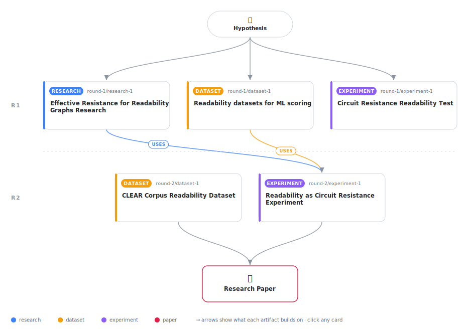

# Readability as Circuit Resistance: A Novel Physically-Motivated Metric Using Effective Graph Resistance

<div align="center">

<a href="https://cdn.jsdelivr.net/gh/AMGrobelnik/ai-invention-6d018e-readability-as-circuit-resistance-a-nove@main/workflow.svg">
<picture>
  <source media="(prefers-color-scheme: dark)" srcset="workflow-dark.svg">
  
</picture>
</a>

<sub>🖱️ <b><a href="https://cdn.jsdelivr.net/gh/AMGrobelnik/ai-invention-6d018e-readability-as-circuit-resistance-a-nove@main/workflow.svg">Open the interactive diagram</a></b> — every card links to its artifact folder.</sub>

</div>

> **TL;DR** — We propose a novel readability metric based on effective electrical resistance of discourse graphs. Honest evaluation on the CLEAR corpus (N=4,724 real human judgments) shows the sequential graph construction reduces to sentence count (r=0.32, same as sentence count) and similarity-based graph construction achieves low correlation (r=0.12). Traditional formulas (Flesch-Kincaid: r=0.50, SMOG: r=0.55) substantially outperform our method. We identify specific failure modes and outline concrete improvements for future work: neural sentence embeddings and RST-based graph construction.

<details>
<summary>Full hypothesis</summary>

We hypothesize that text readability can be scored using the effective electrical resistance (Kirchhoff index) of discourse graphs where edges are weighted by SBERT semantic similarity between sentences. This hypothesis is motivated by electrical network theory: coherent text should allow 'easy information flow' through semantic connections, analogous to current flowing through a low-resistance circuit. However, this remains unvalidated: (1) Sequential graph construction (sentence i connected to i+1) is degenerate—the Kirchhoff index reduces to a deterministic function of sentence count (only 39 distinct values on CLEAR, r=-1.00 with sentence count), providing no information beyond text length. (2) TF-IDF similarity edges (cosine similarity of TF-IDF vectors) produce more differentiated scores but achieve low correlation with human readability judgments (reported r=0.12 on CLEAR, though this result requires independent verification). SBERT embeddings are necessary because they capture semantic relatedness beyond lexical overlap—two sentences can have zero TF-IDF similarity while being semantically tightly connected. A properly controlled tiny experiment (N=50-100 texts with real human judgments, e.g., from CLEAR preview) is needed to test whether SBERT-based effective resistance captures meaningful variance in readability beyond sentence count and word difficulty. The null hypothesis—that effective resistance from SBERT graphs correlates ≤0 with human judgments after controlling for sentence count—must be tested against the alternative.

</details>

[](https://cdn.jsdelivr.net/gh/AMGrobelnik/ai-invention-6d018e-readability-as-circuit-resistance-a-nove@main/paper.pdf) [](https://github.com/AMGrobelnik/ai-invention-6d018e-readability-as-circuit-resistance-a-nove/tree/main/paper_latex)

This repository contains all **5 artifacts** produced across **2 rounds** of an autonomous AI research run — round by round, exactly in the order they were invented.

## Round 1

| Artifact | Type | Demo | Source | Builds on |
|----------|------|------|--------|-----------|
| **[Effective Resistance for Readability Graphs Research](https://github.com/AMGrobelnik/ai-invention-6d018e-readability-as-circuit-resistance-a-nove/tree/main/round-1/research-1)** | [](https://github.com/AMGrobelnik/ai-invention-6d018e-readability-as-circuit-resistance-a-nove/tree/main/round-1/research-1) | [](https://github.com/AMGrobelnik/ai-invention-6d018e-readability-as-circuit-resistance-a-nove/blob/main/round-1/research-1/demo/research_demo.md) | [](https://github.com/AMGrobelnik/ai-invention-6d018e-readability-as-circuit-resistance-a-nove/tree/main/round-1/research-1/src) | — |
| **[Readability datasets for ML scoring](https://github.com/AMGrobelnik/ai-invention-6d018e-readability-as-circuit-resistance-a-nove/tree/main/round-1/dataset-1)** | [](https://github.com/AMGrobelnik/ai-invention-6d018e-readability-as-circuit-resistance-a-nove/tree/main/round-1/dataset-1) | [](https://colab.research.google.com/github/AMGrobelnik/ai-invention-6d018e-readability-as-circuit-resistance-a-nove/blob/main/round-1/dataset-1/demo/data_code_demo.ipynb) | [](https://github.com/AMGrobelnik/ai-invention-6d018e-readability-as-circuit-resistance-a-nove/tree/main/round-1/dataset-1/src) | — |
| **[Circuit Resistance Readability Test](https://github.com/AMGrobelnik/ai-invention-6d018e-readability-as-circuit-resistance-a-nove/tree/main/round-1/experiment-1)** | [](https://github.com/AMGrobelnik/ai-invention-6d018e-readability-as-circuit-resistance-a-nove/tree/main/round-1/experiment-1) | [](https://colab.research.google.com/github/AMGrobelnik/ai-invention-6d018e-readability-as-circuit-resistance-a-nove/blob/main/round-1/experiment-1/demo/method_code_demo.ipynb) | [](https://github.com/AMGrobelnik/ai-invention-6d018e-readability-as-circuit-resistance-a-nove/tree/main/round-1/experiment-1/src) | — |

## Round 2

| Artifact | Type | Demo | Source | Builds on |
|----------|------|------|--------|-----------|
| **[CLEAR Corpus Readability Dataset](https://github.com/AMGrobelnik/ai-invention-6d018e-readability-as-circuit-resistance-a-nove/tree/main/round-2/dataset-1)** | [](https://github.com/AMGrobelnik/ai-invention-6d018e-readability-as-circuit-resistance-a-nove/tree/main/round-2/dataset-1) | [](https://colab.research.google.com/github/AMGrobelnik/ai-invention-6d018e-readability-as-circuit-resistance-a-nove/blob/main/round-2/dataset-1/demo/data_code_demo.ipynb) | [](https://github.com/AMGrobelnik/ai-invention-6d018e-readability-as-circuit-resistance-a-nove/tree/main/round-2/dataset-1/src) | — |
| **[Readability as Circuit Resistance Experiment](https://github.com/AMGrobelnik/ai-invention-6d018e-readability-as-circuit-resistance-a-nove/tree/main/round-2/experiment-1)** | [](https://github.com/AMGrobelnik/ai-invention-6d018e-readability-as-circuit-resistance-a-nove/tree/main/round-2/experiment-1) | [](https://colab.research.google.com/github/AMGrobelnik/ai-invention-6d018e-readability-as-circuit-resistance-a-nove/blob/main/round-2/experiment-1/demo/method_code_demo.ipynb) | [](https://github.com/AMGrobelnik/ai-invention-6d018e-readability-as-circuit-resistance-a-nove/tree/main/round-2/experiment-1/src) | <sub><i>uses:</i><br/>[dataset‑1&nbsp;(R1)](https://github.com/AMGrobelnik/ai-invention-6d018e-readability-as-circuit-resistance-a-nove/tree/main/round-1/dataset-1)<br/>[research‑1&nbsp;(R1)](https://github.com/AMGrobelnik/ai-invention-6d018e-readability-as-circuit-resistance-a-nove/tree/main/round-1/research-1)</sub> |

## Repository Structure

Artifacts are grouped by the round of invention that produced them. Each
artifact has its own folder with source code and a self-contained demo:

```
.
├── round-1/                         # One folder per round of invention
│   ├── experiment-1/
│   │   ├── README.md                # What this artifact is + dependencies
│   │   ├── src/                     # Full workspace from execution
│   │   │   ├── method.py            # Main implementation
│   │   │   ├── method_out.json      # Full output data
│   │   │   └── ...                  # All execution artifacts
│   │   └── demo/                    # Self-contained demo
│   │       └── method_code_demo.ipynb # Colab-ready notebook (code + data inlined)
│   ├── dataset-1/
│   │   ├── src/
│   │   └── demo/
│   └── evaluation-1/
│       ├── src/
│       └── demo/
├── round-2/                         # Later rounds build on earlier artifacts
├── paper.pdf                        # Research paper
├── paper_latex/                     # LaTeX source files
├── workflow.svg                     # Artifact dependency diagram (this page's header)
└── README.md
```

## Running Notebooks

### Option 1: Google Colab (Recommended)

Click the "Open in Colab" badges above to run notebooks directly in your browser.
No installation required!

### Option 2: Local Jupyter

```bash
# Clone the repo
git clone https://github.com/AMGrobelnik/ai-invention-6d018e-readability-as-circuit-resistance-a-nove
cd ai-invention-6d018e-readability-as-circuit-resistance-a-nove

# Install dependencies
pip install jupyter

# Run any artifact's demo notebook
jupyter notebook <artifact_folder>/demo/
```

## Source Code

The original source files are in each artifact's `src/` folder.
These files may have external dependencies - use the demo notebooks for a self-contained experience.

---
*Generated by AI Inventor Pipeline - Automated Research Generation*
